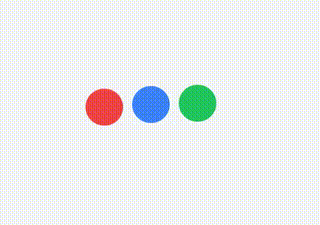
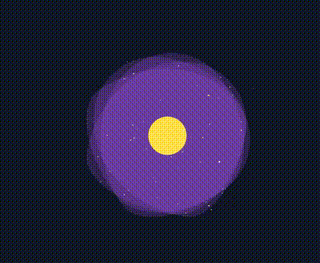
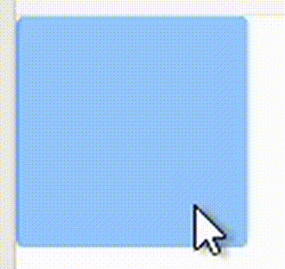
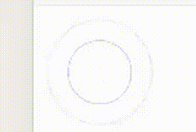
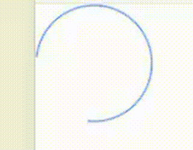
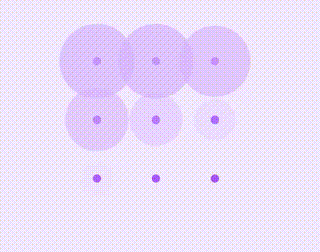
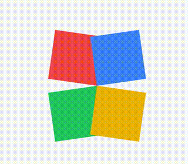

# Vibrant Loaders

A versatile collection of unique orange-themed loaders designed for shopping websites and e-commerce applications. These loaders are compatible with React, Next.js, and other JavaScript frameworks.
A samlme useages for the loaders. https://loaders-showcase.vercel.app/

## Table of Contents

- [Vibrant Loaders](#vibrant-loaders)
  - [Table of Contents](#table-of-contents)
  - [Installation](#installation)
  - [Usage](#usage)
    - [Mini Loaders](#mini-loaders)
  - [Loader Samples](#loader-samples)
    - [Atom Loader](#atom-loader)
    - [Bouncing Dots Loader](#bouncing-dots-loader)
    - [Galaxy Loader](#galaxy-loader)
    - [Mini Flip Loader](#mini-flip-loader)
    - [Mini Pulse Loader](#mini-pulse-loader)
    - [Mini Ripple Loader](#mini-ripple-loader)
    - [Mini Spinner Loader](#mini-spinner-loader)
    - [Pulse Grid Loader](#pulse-grid-loader)
    - [Rotating Squares](#rotating-squares)
    - [Wave Loader](#wave-loader)
    - [ShopingLoader](#shopingloader)

## Installation

Install the package using npm:

```bash
npm install vibrant-loaders
```
## Usage
```jsx
import { AtomLoader, GalaxyLoader, WaveLoader } from 'vibrant-loaders';

function App() {
  return (
    <div>
      <AtomLoader size={32} coreColor="red-500" electronColor="pink-300" />
      <GalaxyLoader size={100} armColor="indigo-600" coreColor="yellow-400" />
      <WaveLoader size={64} waveColor="teal-400" particleColor="teal-100" />
    </div>
  );
}
```
### Mini Loaders
These mini loaders are designed to be compact and easily integrated into various parts of a UI. They can be used in buttons, forms, or any other small UI elements where you need to indicate loading or processing.

To use these mini loaders, you can import them from your package and use them in your React components like this:

```jsx
import {
  MiniPulseLoader,
  MiniDotsLoader,
  MiniSpinnerLoader,
  MiniFlipLoader,
  MiniHourglassLoader,
  MiniRippleLoader
} from 'vibrant-loaders';

function App() {
  return (
    <div className="flex space-x-4 items-center">
      <button className="px-4 py-2 bg-blue-500 text-white rounded">
        Submit <MiniDotsLoader size={16} color="white" />
      </button>
      <div>Loading... <MiniSpinnerLoader size={20} color="blue-600" thickness={3} /></div>
      <div><MiniPulseLoader size={24} color="green-500" /></div>
      <div><MiniFlipLoader size={28} frontColor="purple-500" backColor="purple-300" /></div>
      <div><MiniHourglassLoader size={24} color="orange-500" /></div>
      <div><MiniRippleLoader size={32} color="red-500" /></div>
    </div>
  );
}
```


## Loader Samples

### Atom Loader


### Bouncing Dots Loader


### Galaxy Loader


### Mini Flip Loader


### Mini Pulse Loader


### Mini Ripple Loader


### Mini Spinner Loader


### Pulse Grid Loader


### Rotating Squares


### Wave Loader


### ShopingLoader


